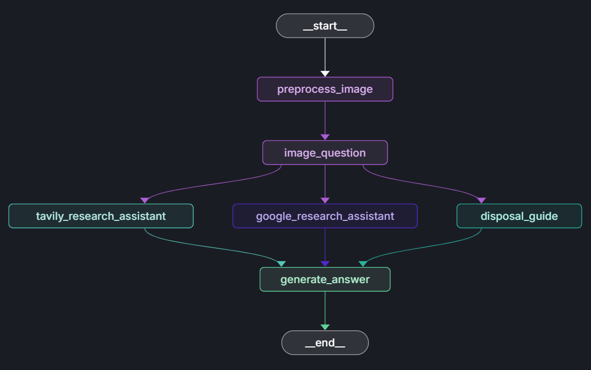

# Binji

Meet Binji — your AI-powered companion for smarter, cleaner living.
Navigating waste disposal rules in a foreign country can be confusing, but Binji makes it simple. Using multi-modal AI, Binji identifies items from a photo and provides clear, location-specific disposal instructions. Whether you're dealing with food waste, plastics, or electronics, Binji ensures you always bin it right — based on local regulations.

## Key Features

*   **Image-based item identification:** Users can take a picture or upload an image of a waste item.
*   **AI-powered disposal guidance:** The application uses a series of AI models to:
    *   Identify the item in the image.
    *   Research the correct disposal method for that item in a specific country.
    *   Generate a clear and concise answer with disposal instructions.
*   **Multiple research sources:** The application can use Tavily, Google Search, and a built-in disposal guide to find the most accurate information.
*   **Streamlit-based web interface:** The application is built with Streamlit, providing a simple and interactive user experience.

## How it works

1.  The user uploads an image or takes a picture of a waste item.
2.  The application preprocesses the image and uses a visual model to identify the item and generate a question about how to dispose of it.
3.  The application then uses research tools (Tavily, Google, or a local guide) to find the answer to the question.
4.  Finally, a language model generates a user-friendly answer based on the research results.

## Processing Pipeline

The application's workflow is implemented as a directed graph, where each node represents a processing step. The main nodes are:

- **preprocess_image**: Resizes and validates the uploaded image.
- **image_question**: Uses a visual language model to generate a disposal-related question about the item in the image.
- **tavily_research_assistant**: Uses Tavily to research disposal methods.
- **google_research_assistant**: Uses Google Search to research disposal methods.
- **disposal_guide**: Looks up disposal instructions in a built-in guide.
- **generate_answer**: Synthesizes research results and generates a final, user-friendly answer.

The pipeline is orchestrated as follows:

Each research node can contribute information, and all results are combined in the final answer.

